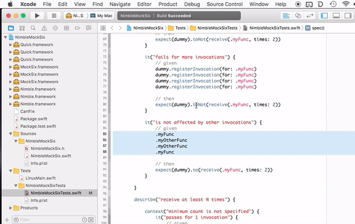
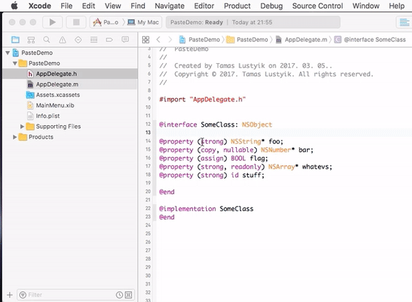

# XcodeColumnOps

Xcode source editor extensions that work with columns.

### Paste Columns

Although Xcode supports cutting rectangular selections, it cannot paste them with preserving the shape. This command does just that.

### Paste Columns Along Selection

Paste any single-line text from the clipboard in column mode in each line that the current selection spans. 

